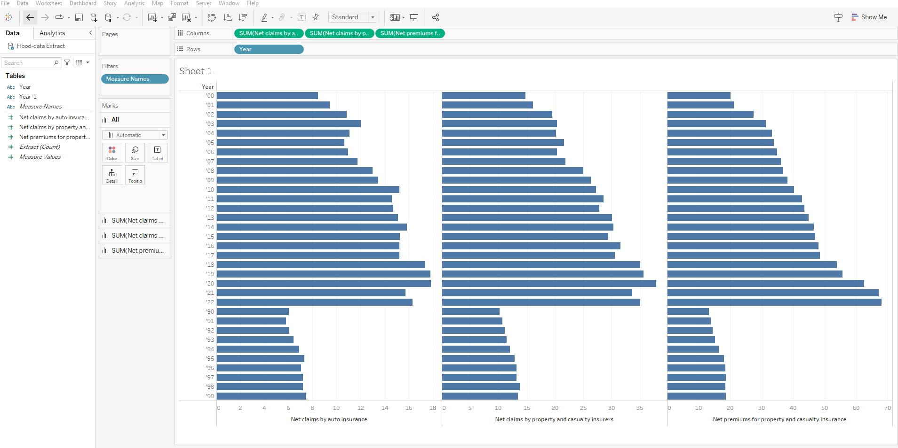
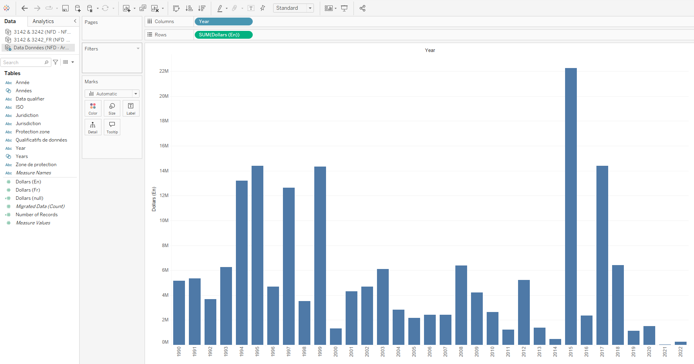
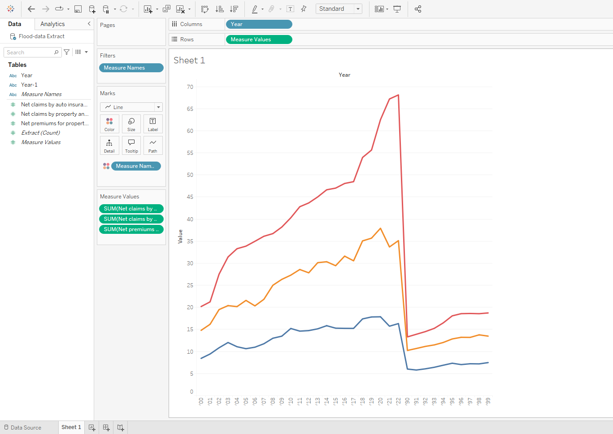
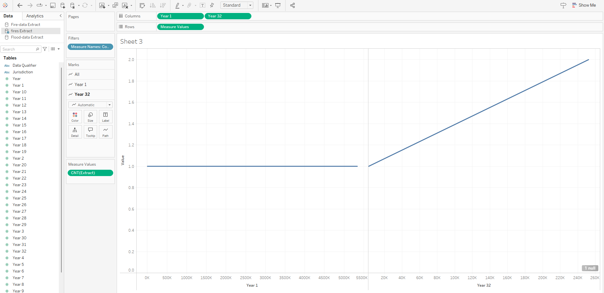

# nb-climate-adaptation-decision 
Policy backgrounder analyzing a climate adaptation funding decision in New Brunswick, examining trade-offs between coastal flood-protection infrastructure and long-term forest-based resilience strategies.

## Decision Statement 
Should the New Brunswick Minister of Natural Resources and Energy Development prioritize public funding for coastal flood-protection infrastructure (such as dikes and seawalls) or invest in forest-based carbon sequestration and wildfire-resilience programs to address climate risks?
## Executive Summary 
Rising sea levels, storm surges, flooding along the coast, and increasing stress on forest ecosystems are just a few of the climate-related threats that New Brunswick is dealing with. Public safety, housing, infrastructure, and important economic sectors including tourism, forestry, and fisheries are all at risk. Provincial decision-makers have to decide how to split limited preservation resources in ways that reduce long-term vulnerability while managing current concerns as the effects of climate change rise.

The main choice this project looks at is whether public funding should go toward forest-based resilience strategies like carbon storage, better forest management, and wildfire risk reduction or engineered coastal flood-protection measures like dikes, seawalls, and other protective infrastructure.
Investments in coastal infrastructure can offer those in danger quick and visible protection, but they are expensive and may have negative ecological effects. Even if they take longer to provide verifiable protection, forest-based strategies have longer-term advantages like reducing emissions, increasing ecosystem health, and lowering the risk of disasters in both rural and inland areas.

The two choices of unbalanced distribution of costs and benefits across stakeholder groups and geographical areas, as well as the unpredictable nature of climate change, make this decision extremely difficult but critical. Selecting one strategy over another could limit the future flexibility and influence New Brunswick's adaptation to climate change strategy for years. Making an effective and effective policy decision consequently demands an understanding of the feedback they receive, delays, and unintended consequences related to each choice.
## Initial CLD:

## Initial CLD Diagram Description
The CLD diagram shows us how climate change has the ability to increase coastal flood risk and infrastructure damage, driving investmentin flood-protection infrastructure that could encourage further coastal development and support long-term risk (R1). The balamcing loop has thr ability to capture how rising adaptation  spending creates fiscal pressure that constrains additional investment (B1). The second balancing loop illustrates how investment in forest-based resilience strengths long-term climate resilience, reducing future climate impacts and stabilizing the system over time 

## Visualization 1

This visualization shows that flood-related costs have increased across multiple insurance measures since 1999, with noticeably higher net claims in the later years and rising property and casualty premiums over time. The pattern suggests that flooding is creating growing and persistent financial losses rather than isolated one-off events. This matters for the Minister’s decision because it supports the case that coastal flooding is an escalating and costly risk, strengthening the rationale for investing in flood-protection infrastructure to reduce recurring damage. At the same time, the upward pressure on premiums signals that the costs are being passed to households and businesses, raising affordability and equity concerns that make risk reduction more urgent.

## Visulaization 2

This visualization reveals that wildfire-related housing damage is highly volatile, with most years showing relatively lower losses but a few extreme spike years (notably the mid-1990s, late 1990s, and especially 2016–2017) driving major total costs. This indicates wildfire damage is shaped by episodic, high-impact events rather than a smooth upward trend, meaning a single severe season can create outsized losses. This matters for the Minister’s decision because it supports investing in wildfire-resilience and forest management to reduce the likelihood and severity of catastrophic events that cause sudden housing loss and major recovery spending. It also highlights that waiting to react after a severe fire year can be far more expensive than preventative investments that lower exposure and improve resilience.
## Visualization 3

This visualization presents flood-related auto claims, property and casualty claims, and property and casualty premiums together in a single time-series chart, allowing for direct comparison of how they move over time. The chart shows that as net claims increase—particularly during major loss years—premiums also trend upward, indicating that rising flood damages are closely linked to increased insurance costs. The parallel movement between claims and premiums suggests that climate-related losses are being transferred to households and businesses through higher premiums. For the Minister, this reinforces the urgency of reducing flood risk through protective infrastructure, as failing to address underlying damages may continue driving up costs across the insurance system and increasing financial pressure on residents.
## Visualization 4

This visualization compares the total housing damage costs from forest fires in 1999 and 2020, highlighting a substantial increase between the two years. The clear upward difference suggests that wildfire-related damages have intensified over time, indicating greater financial exposure in more recent years. This matters for the Minister’s decision because it signals that wildfire risk is not only episodic but potentially growing in severity, increasing the long-term cost burden on communities and government disaster spending. The comparison strengthens the case for investing in forest-based resilience and wildfire mitigation programs, as preventative measures may reduce the likelihood of future high-cost fire seasons.

## Milestone 3: Path A Foundational (System Focus) 

System Archetype Identification: 
The system schetypes I chose was "Shifting the Burden". Shifting the burden is when a quick fix undermindes the capacity for fundamental solutions. New Brunswick's climate adaptation funding decision fits perfectly within this archetype. Within this system, the rising climate related cost associated with damages help create a pressure for the Minister to take immediate action. Investing in a coastal flood protection infastrucutre/program would act as the quick and visible response to the flooding across Canada. The forest based carbon sequestration and wild-fire resilience programs would represent a program that goes deeper and is more of a long-term solution to address the broader climate issue. 

As the cost for flooding goes up the public and political pressure will also go up for the investments that would show us short-term results. Examples of this coould be dikes and seawalls. These solutions for the costal flooding would reduce the damage of flooding in some areas but they do not help to address the ecological and climate drivers that make wildfires and resiliance risks long-term. This would create a system that decision makers will most likely rely on what ever solution appears to be more short-term, which leads to underinvesting in the long-term solution. 

Key Variables Within the Archetype: 

* Climate Change Impacts
* Costal Flood Risk
* Infrastructure Damage
* Insurande Claims
* Insurance Premiums
* Forest Based Resilience Investments
* Costal Flood Protection Investment
* Wildfire Housing Damage
* Long Term Climate Resilience

The reinforcing loop of the rising climate damage increases claims, premiums, and pressure for the short-term soultion, while the balancing of forest resilience loop would work much more slowly to help to reduce the long-term vulnerability. 

Evidence from Milestone 2 that supports the structure:

* Flood-related insurance claims and premiums increased from 1990-2022. Especially in the later years, showing how the financial pressure will grow because of the flood damage
* Looking at the combined data of flood claims and premiums shows us that the increased losses usually are related to the premiums being higher.
* Wildfire housing damage increased rapidly in different years. This shows that the climate related risk is not only limited to the costal flooding.
* Comparing the wildfire damage in 1999 to 2020 shows the housing loss due to fires has increased over time.

This system reflects a short-term response to the visible damage can have an affect and weaken the long-term climate resilience.

## Systems Archetype Diagram 

This diagram shows the shifting the burden archetype applied to the New Brunswick climate adaption system. The increasing climate impacts would cause pressure to make immediate flood damage protection, while investing in forest based resilience would offer a more long-term but way less visible solution to a slower moving issue. 

